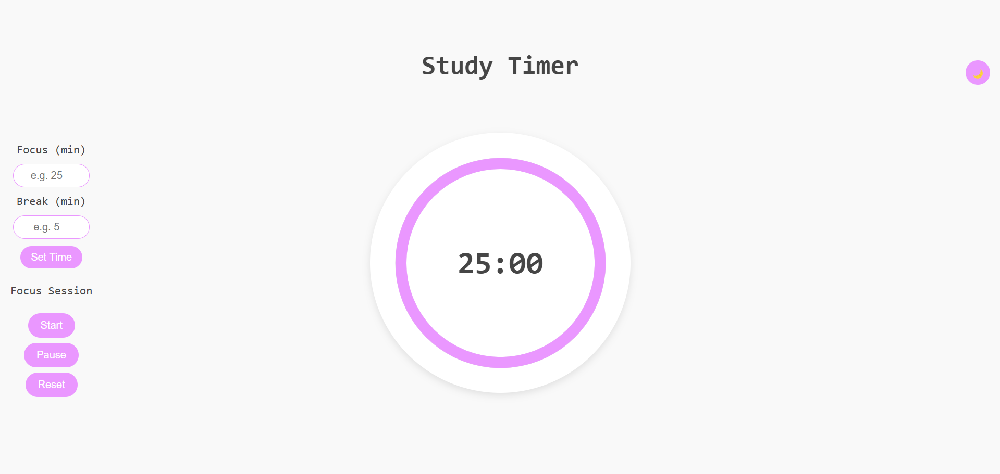

# Study-Timer

--- 

A simple and interactive **Pomodoro-style study timer** built with **HTML, CSS, and JavaScript**.  
This timer helps students and professionals stay focused by alternating between **study sessions** and **breaks**.  

---

## 🚀 Features  
- ⏱ Customizable **Focus** and **Break** durations  
- 🎵 Alarm sound notification when time is up  
- ▶️ **Start**, ⏸ **Pause**, and 🔄 **Reset** functionality  
- 🎨 Clean and responsive UI with animated circular timer  
- 💻 Works across different devices (desktop & mobile)  

---

## 📸 Preview  

### Timer Interface
 <!-- Replace with actual screenshot file path -->

---

## 🛠️ Installation  

1. Clone the repository  
   ```bash
   git clone https://github.com/your-username/study-timer.git
````
---

2. Navigate to the project folder

   ```bash
   cd study-timer
   ```
---

3. Open `index.html` in your browser.

---

## 🎯 How to Use

1. Enter **Focus time** (e.g., 25 minutes) and **Break time** (e.g., 5 minutes).
2. Click **Set Time** to update the timer.
3. Use the controls to manage your session:

   * **Start** → Begin the focus session
   * **Pause** → Temporarily stop the timer
   * **Reset** → Reset back to the initial time

When the focus session ends, the alarm will play. You can then start your **break session**.

---

## 🔮 Future Improvements

* Add session history tracking
* Dark mode support
* Configurable alarm sounds
* Progressive Web App (PWA) support

---

## 🤝 Contributing

Contributions are welcome!

* Fork the repo
* Create a new branch (`feature-name`)
* Commit your changes
* Open a pull request

---

## 👩‍💻 Author

Developed by [Bhumi-017](https://github.com/Bhumi-017) 🚀

---
